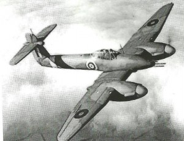

Beauty is in the eye of beholder, but I always thought that this was one of the nicer looking aeroplanes of WWII, and, possibly, according to some accounts, one of the nicer planes to fly.

In 1936, with growing concern over the prospect of war with Germany, the Air Ministry was looking to the aircraft industry to equip the RAF. Specifications had been provided for a number of aircraft and, of course they had requested a number of single engine single seat fighters, most notably the Spitfire and Hurricane. These fighters were small and intended primarily for defensive activities, they carried a relatively small amount of fuel and, as a consequence, had a limited range. The Ministry were aware of the twin engined German Messerschmitt 110 and invited tenders for a British twin engine fighter. A number of manufacturers responded and the Whirlwind wasWestland’s proposal. The design team at Westlands was led by the relatively young Ted Petter, who later went to work for English Electric and was largely responsible for the design of the highly successfulCanberraand Lightning. As required by the specification the Whirlwind had four 20mm cannons, these were mounted in the nose, giving it greater and more concentrated firepower than any other fighter plane of that period. Although it also had a rather limited range it was more than twice that of the Spitfire. It was very fast and was at least as fast as the Spitfire at low altitude. Its fuselage was no bigger than the Hurricane’s and it was almost as agile as the single engine fighters. Initial trials were promising and an order was placed.

The Whirlwind was powered by two Rolls Royce Peregrine engines, a development of the older RR Kestrel. These engines suffered from some development problems that caused some reliability shortcomings and slowed the supply of new engines, a difficulty made worse because Rolls Royce were concentrating much of their effort on the newer and more powerful Merlin. The Peregrine was not suitable for a high degree of supercharging, this resulted in a significant fall off in power at higher altitudes that imposed a limit on the performance of the Whirlwind. The slow supply of reliable Peregrines delayed the delivery of Whirlwinds to the RAF and the first Whirlwinds were not in operational service until late in 1940. Unfortunately the small and nimble Whirlwind was designed around the Peregrine and could not be easily modified to use the larger Merlin. Aircraft factories (mostly former car factories) were concentrating on the production of Spitfires and Hurricanes and Westland had only limited production capability. The net result was that only 119 Whirlwinds were ever produced (that sounds quite a lot by today’s standards but in those days production rates were in the thousands) and only two RAF squadrons were equipped with them.

Those that went into service proved to be very capable fighters, performing well against the Luftwaffe’s best at lower altitudes. With their four cannons, they also proved to be an excellent ground attack aircraft, a role that was further developed by fitting bomb racks beneath the wings. The single engine Hawker Typhoon took on this role later in the war, but this was fitted with Napier Sabre engines and it too had problems with engine reliability, rather more I suspect, than was experienced with the Peregrines.

Pilots spoke very highly of the Whirlwind. The location of the cockpit behind the wings and the then novel ‘blister’ canopy gave good visibility, it also gave good ‘crash absorption’ so that pilots had a better chance of survival. One pilot is reported a s saying “It was regarded with absolute confidence and affection.” and another said “The Whirlwind was great to fly – we were a privileged few.”

Given better engines and with further development it is quite likely that the Whirlwind could have become one of the second world war greats, but situations were against it almost from the start and it has almost disappeared from people’s consciousness. Subsequently the range and armament of single engine fighters was improved reducing the need for the very nimble twin engine fighter. Somewhat larger twin engine planes emerged, notably the deHavilland Mosquito and Bristol Beaufighter, that had greater range and greater flexibility in applications.

Ron Watts
