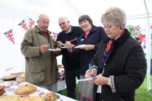

**Cool Koop steers Boughton home  -  13/05/2012**

Boughton got its season under way successfully with a closely contested victory at neighbours Gooderstone, with opener Eliot Koopowitz carrying his bat through the innings with a match-winning 77 runs not out. It was great to start to the new season at Gooderstone’s pretty ground, well-supported by our loyal travelling band equipped with their heavy coats, blankets and umbrellas to watch the beautiful summer game!

Given the deluge we have experienced in recent weeks, the Gooderstone wicket played very well for the batsmen, with a hint of seam movement available as help for the bowlers. The outfield was a little slow, only to be expected, but quite a number of boundaries were registered by both teams, keeping supporters around the ropes on their toes!

Barry Ovel and Hugh Jenkins opened the bowling with typically accurate and tight spells, both collecting wickets from the Gooderstone top order. Ovel then turned to the ‘dark side’ as he donned pads and gloves to play the remainder of the match as wicket keeper (which he did splendidly!) Alex Reardon generated some nice pace during his spell, with a few nicely disguised ‘changeups’ thrown in to deceive the opposition. Koopowitz’s deadly twirlers accounted for 3 Gooderstone wickets,including the top-scoring S. Merritt, plus 10 and Jack to end the Gooderstone innings.

The match was marked by a couple of standout catches from Boughton. First, Alex Reardon’s sharp diving catch at gully to dismiss Gooderstone opener M. Smith gave Boughton momentum at the beginning of the innings. Second, spectators had the treat of seeing Koopowitz take a catch off Pogmore’s bowling that is as good as you’ll see in _any_ standard of cricket. Diving full-length to pouch a screaming shot from the dangerous-looking Bandy, it brought back memories of Jonty Rhodes in his pomp.

Opening the batting for the first time for Boughton, Steve Short played a battling innings, occupying the crease with confidence and helping take the Boughton total to 31 runs before falling to Brookes for 4.  Josh Reardon showed aggressive intent for his 10 runs, lifting the ball back over the bowler’s head on a number of occasions, with Jenkins contributing a couple of boundaries as Boughton edged closer to their winning total.

New to the club this season are father and son dynamic-duo Colin and Theo Brown. Colin freely admitted, though he loves cricket, he had not hefted a bat since his schooldays. Despite that, he played a little cameo of an innings until his hamstring had other ideas, unfortunately forcing him to retire hurt on 6 runs. Some gentle stretching needed before the next match Colin! Son, Theo chipped in with a tidy debut bowling performance, opening up his account with a Maiden over, keeping the pressure on the Gooderstone middle order.

Ben Wilkinson performed well as captain, making good bowling changes and providing constant encouragement to all players while out in the field. Ben also turned in a shortbut hostile spell of fast bowling, accounting for the wicket of Morgan nicely taken behind the furniture by Ovel.

So, a great start to the season by Boughton with a great team performance. A tight bowling and fielding performance restricted Gooderstone, withKoopowitz’s anchoring innings bringingcontributions all the way down the order to help Boughton chase-down 148 runs for victory. Needless to say it was an exciting match, played in great spirit, with both teams fielding a balanced blend of seniors and juniors. Thanks again to our hosts Gooderstone, and we look forward to inviting them back to Boughton for a return match later in the season!

Boughton C.C. – S. Short, E. Koopowitz, C. Brown, A. Bowles, J. Reardon, H. Jenkins, B. Wilkinson (Capt.), B. Ovel, A. Reardon, M. Pogmore, T. Brown.

 **Boughton beat the weather and turned out in force to enjoy our Jubilee celebrations.**

 Our runners did us proud. Chloe, Rory, Ollie, Jake, Steve and friends took the torch at Cavenham Corner, after a very chilly wait. Geoff drove back to the green in his truck to let people know that it won’t be too much longer now. He came back and told us “ There’s hundreds of people on the green, banners, cheering, there’s hundreds of them.”

 The group of runners received an awesome Boughton welcome at the Green, torch held high, legs pumping, it made the hairs on the back of my neck prickle. I will never forget it.

Then came the Pie judging, what a wonderful response. The judges had a very difficult but mouth-watering task. Which they performed with the greatest of grace and integrity. Results: -

 Junior Section.3rd.  Amy Dewart ( 2011, Defending Bucket champion ) 2nd.   Isabelle Beeston.

 Winner.   Joint – Ben & Eloise George.

 Adult Section. 3rd.   Brian Bradley  2nd.   Mark Solomon. Winner.   Tom Roberts.

 The standard of Entry was extremely high, Geoff & I salute the Pie makers of Boughton.

 Boughton Cricket Club, Village Caravan, Parochial Church Council and  Parish Council all came together to provide a great celebration on a very damp green. The Spirit of Boughton – what can I say – Wonderful.

 Then, what made it all so worthwhile, was a young boy knocking on my door to say thank you for a great day.

 Frank.
